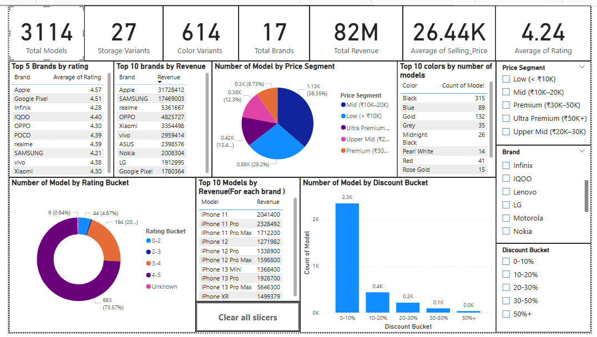

# 📱 Flipkart Mobile Market Analysis – Power BI Dashboard

This repository contains a complete analysis of the mobile phone market on Flipkart using **Power BI**. The objective was to analyze product listings, segment pricing trends, evaluate brand positioning, and derive actionable insights based on various smartphone features.

---

## 📌 Objective

Using the dataset containing specifications, pricing, and brand details of smartphones listed on Flipkart, the following key business questions were answered:

1. What are the different price range segments for mobiles in India?
2. Which brand provides the most product offerings for the Indian Market?
3. Which brand caters to all different segments? (Low range, Mid range, Premium)
4. What specifications are most commonly offered by various brands?
5. What are the discount patterns in the market?
6. What additional insights can be derived from this dataset?

---

## 📂 Files Included

| File Name                             | Description                                     |
|--------------------------------------|-------------------------------------------------|
| `Dashboard_Onkar_sonawane.pbix`      | Power BI file containing data model and visuals |
| `Dashboard.png`                      | Main dashboard overview snapshot                |
| `Insights Report_Onkar_sonawane_Bill_easy.pdf` | Detailed PDF report with answers & insights    |
| `Mobile market analysis.png`         | Focused price segment vs brand matrix           |
| `Question 2.png`                     | Brand-wise model count                          |
| `Question 3.png`                     | Brands covering all price segments              |
| `Question 4.png`                     | RAM and Storage trend visual                    |

---

## 📊 Dashboard Preview

### 🧭 Market Overview Dashboard

### 🧮 Brand vs Price Segment Matrix

---

## 📈 Key Insights

- **Mid-range smartphones (₹10K–₹20K)** dominate the listings, showing high demand in this segment.
- **Samsung, Xiaomi, OPPO, and vivo** offer products across all price segments, indicating a wide customer base.
- The most common configuration is **4 GB RAM / 64 GB storage**, making it the sweet spot for value seekers.
- Brands like **Realme and Infinix** frequently offer **20–30% discounts**, reflecting their aggressive pricing strategy.

---

## 🛠 Tools & Skills Used

- **Power BI**: For data modeling, transformation, and dashboard building
- **DAX**: Used for calculated columns like Discount %, Price Segments, and Buckets
- **Excel**: For raw data inspection and preprocessing
- **Data Visualization & Reporting**

---

## 📬 Contact

Made with curiosity and data-driven enthusiasm by **Onkar Sonawane**  
Feel free to reach out via [LinkedIn](https://www.linkedin.com/) or raise a GitHub issue.

---
